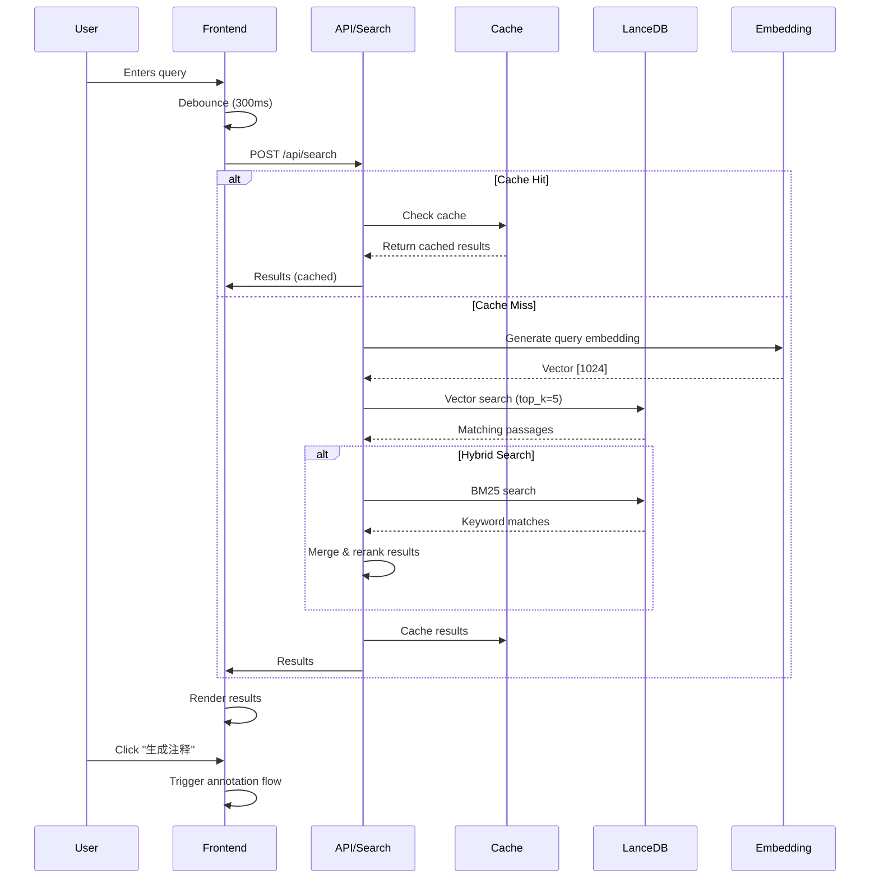
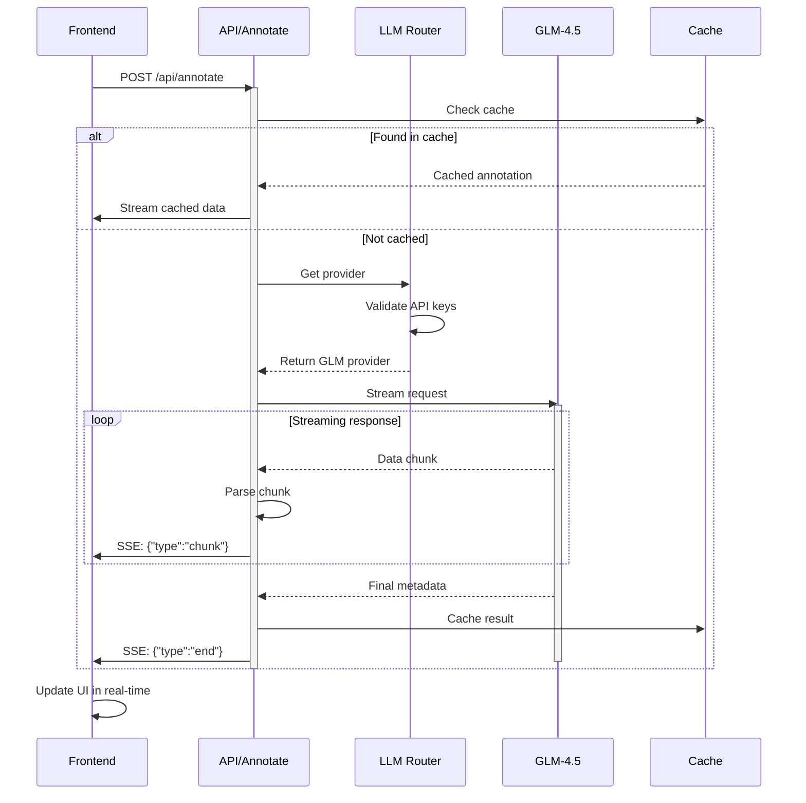
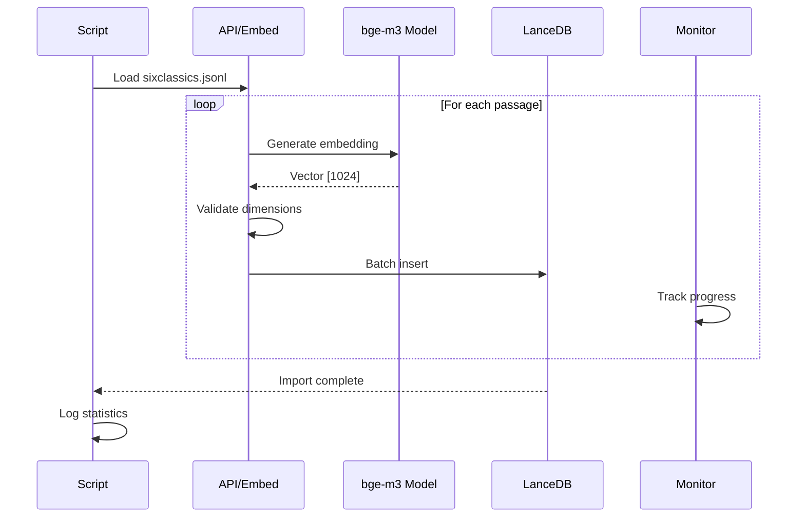
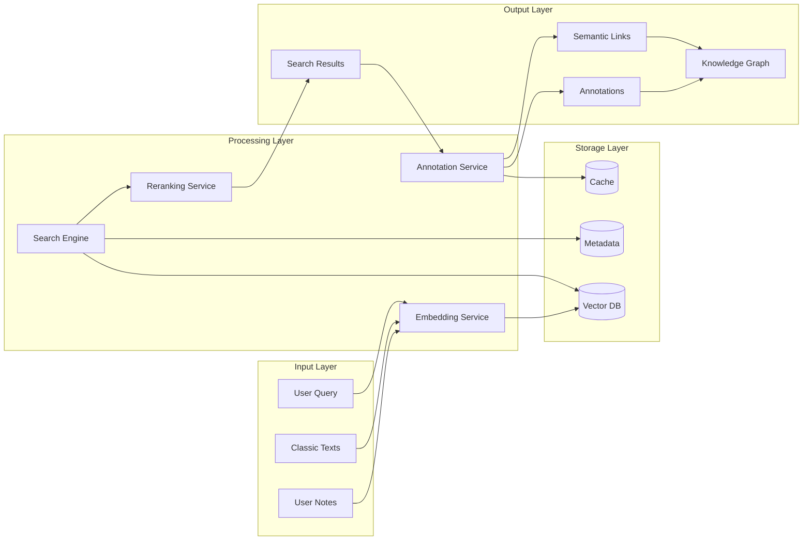
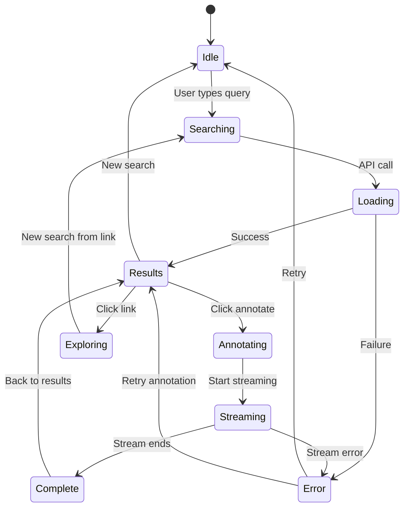

# Component Architecture & API Flows

## 1. Frontend Component Architecture

```mermaid
graph TB
    subgraph "App Router (Next.js 14)"
        LAYOUT[layout.tsx]
        PAGE[page.tsx]
        ANNOTATE[annotate/[id]/page.tsx]
        EXPLORE[explore/page.tsx]
    end

    subgraph "UI Components (components/)"
        subgraph "Search Module"
            SEARCH_INPUT[SearchInput]
            SEARCH_RESULTS[SearchResults]
            RESULT_CARD[ResultCard]
            FILTER_PANE[FilterPane]
        end

        subgraph "Annotation Module"
            STREAMING[StreamingAnnotation]
            ANNOTATION_SEC[AnnotationSection]
            LINK_CHIPS[LinkChips]
            FEEDBACK[FeedbackModal]
        end

        subgraph "Visualization Module"
            KNOWLEDGE_GRAPH[KnowledgeGraph]
            NODE_DETAIL[NodeDetail]
            PATH_VIEWER[PathViewer]
        end

        subgraph "Common Components"
            LOADING[LoadingSpinner]
            ERROR_BOUNDARY[ErrorBoundary]
            MODAL[Modal]
            TOAST[Toast]
        end
    end

    subgraph "State Management"
        ZUSTAND[Store]
        SWR[SWR Cache]
        QUERY_CLIENT[Query Client]
    end

    subgraph "Services"
        API[API Service]
        WEBSOCKET[WebSocket Service]
        ANALYTICS[Analytics Service]
    end

    PAGE --> SEARCH_INPUT
    PAGE --> SEARCH_RESULTS
    SEARCH_RESULTS --> RESULT_CARD
    PAGE --> FILTER_PANE

    ANNOTATE --> STREAMING
    STREAMING --> ANNOTATION_SEC
    ANNOTATE --> LINK_CHIPS
    ANNOTATE --> FEEDBACK

    EXPLORE --> KNOWLEDGE_GRAPH
    EXPLORE --> NODE_DETAIL
    EXPLORE --> PATH_VIEWER

    SEARCH_INPUT --> API
    RESULT_CARD --> API
    STREAMING --> API
    KNOWLEDGE_GRAPH --> WEBSOCKET

    ZUSTAND --> SEARCH_INPUT
    ZUSTAND --> SEARCH_RESULTS
    ZUSTAND --> STREAMING
    SWR --> API
```

## 2. API Flow Diagrams

### 2.1 Search Flow



### 2.2 Annotation Flow (Streaming)



### 2.3 Embedding Flow (Batch Processing)



## 3. Data Flow Architecture



## 4. State Management Flow



## 5. Component Props & Interfaces

### 5.1 Search Components

```typescript
// SearchInput.tsx
interface SearchInputProps {
  value: string;
  onChange: (value: string) => void;
  onSubmit: () => void;
  loading?: boolean;
  suggestions?: string[];
  placeholder?: string;
}

// SearchResults.tsx
interface SearchResultsProps {
  results: SearchResult[];
  loading: boolean;
  query: string;
  onLoadMore: () => void;
  hasMore: boolean;
}

// ResultCard.tsx
interface ResultCardProps {
  result: SearchResult;
  onAnnotate: (id: string) => void;
  onExplore: (links: Link[]) => void;
  cached?: boolean;
}
```

### 5.2 Annotation Components

```typescript
// StreamingAnnotation.tsx
interface StreamingAnnotationProps {
  query: string;
  passage: string;
  passageId: string;
  onComplete: (annotation: Annotation) => void;
  onError: (error: Error) => void;
}

// AnnotationSection.tsx
interface AnnotationSectionProps {
  title: string;
  content: string;
  type: "six_to_me" | "me_to_six";
  loading?: boolean;
}

// LinkChips.tsx
interface LinkChipsProps {
  links: Link[];
  onClick: (link: Link) => void;
  disabled?: boolean;
}
```

### 5.3 Visualization Components

```typescript
// KnowledgeGraph.tsx
interface KnowledgeGraphProps {
  nodes: GraphNode[];
  edges: GraphEdge[];
  onNodeClick: (node: GraphNode) => void;
  onEdgeClick: (edge: GraphEdge) => void;
  layout?: "force" | "hierarchical" | "circular";
  filters?: GraphFilters;
}

// NodeDetail.tsx
interface NodeDetailProps {
  node: GraphNode;
  annotations: Annotation[];
  relatedNodes: GraphNode[];
  onClose: () => void;
}
```

## 6. Service Layer Architecture

```typescript
// Service interfaces
interface SearchService {
  search(query: SearchRequest): Promise<SearchResponse>;
  getSuggestions(query: string): Promise<string[]>;
  getHistory(): Promise<SearchHistory[]>;
}

interface AnnotationService {
  generate(request: AnnotationRequest): Promise<AsyncGenerator<AnnotationChunk>>;
  save(annotation: Annotation): Promise<void>;
  rate(annotationId: string, rating: number): Promise<void>;
}

interface CacheService {
  get<T>(key: string): Promise<T | null>;
  set<T>(key: string, value: T, ttl?: number): Promise<void>;
  invalidate(pattern: string): Promise<void>;
}

// Service factory
class ServiceFactory {
  private static instances: Map<string, any> = new Map();

  static get<T>(name: string): T {
    if (!this.instances.has(name)) {
      switch (name) {
        case "search":
          this.instances.set(name, new SearchService());
          break;
        case "annotation":
          this.instances.set(name, new AnnotationService());
          break;
        case "cache":
          this.instances.set(name, new CacheService());
          break;
      }
    }
    return this.instances.get(name);
  }
}
```

## 7. Error Boundary Implementation

```typescript
// components/ErrorBoundary.tsx
interface ErrorBoundaryState {
  hasError: boolean;
  error?: Error;
  errorInfo?: any;
}

class ErrorBoundary extends Component<
  PropsWithChildren<{}>,
  ErrorBoundaryState
> {
  constructor(props: PropsWithChildren<{}>) {
    super(props);
    this.state = { hasError: false };
  }

  static getDerivedStateFromError(error: Error): ErrorBoundaryState {
    return { hasError: true, error };
  }

  componentDidCatch(error: Error, errorInfo: any) {
    console.error("Error caught by boundary:", error, errorInfo);
    // Log to service (Sentry, etc.)
    logError(error, errorInfo);
  }

  render() {
    if (this.state.hasError) {
      return (
        <div className="error-boundary">
          <h2>Something went wrong</h2>
          <details>
            {this.state.error?.message}
          </details>
          <button onClick={() => this.setState({ hasError: false })}>
            Try again
          </button>
        </div>
      );
    }

    return this.props.children;
  }
}
```

This component architecture provides a clear separation of concerns, making the system maintainable and scalable. Each component has well-defined responsibilities and interfaces, following React best practices and TypeScript for type safety.