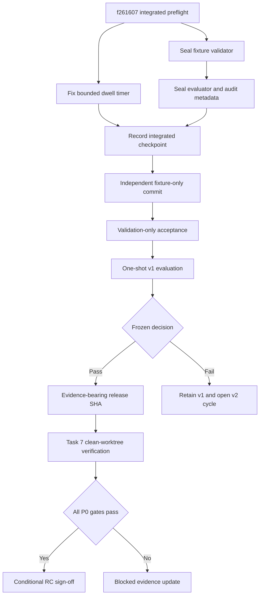

# fix: Complete frozen holdout and integrated release sign-off

## Overview

This plan continues the quality-convergence work from the integrated checkpoint
`f261607bf83560e746507e38d7dd93dffc5b8edb`. That merge preserves
`origin/main@906cde4`, the frozen search implementation at
`81c6365766a7cf8c578cef6b060c5e43345f0d35`, and the protocol content commit at
`71fa97e7da563abc1d3365292132d36a75e6682b`.

The integration itself is structurally sound and its preflight is green.
However, review of the remaining holdout path found that the current generic
evaluation runner is not yet sufficient for a one-shot release decision. It
does not validate the 24/6 fixture contract, detect reuse of visible queries,
enforce the two-part acceptance threshold, or record the commit and artifact
identities required by the frozen protocol.

Therefore the next executable checkpoint is **evaluation-harness sealing**, not
holdout execution. Only after that seal is committed may an independent reviewer
author the fixture. The resulting v1 evidence then feeds the exact integrated
commit that undergoes the final clean-worktree release verification.

## Current Review Verdict

| Area | Verdict | Consequence |
| --- | --- | --- |
| Integration ancestry | Pass | `f261607` has parents `906cde4` and `de369e3`; frozen commits remain ancestors |
| Search freeze | Pass | No diff from `81c6365` under `src/lib/search`, `data/embeddings.json`, or `data/search-graph.json` |
| Integration preflight | Pass | Type check, lint, 12 UI suites / 48 UI tests, documentation tests, and production build pass |
| Holdout fixture | Correctly absent | No v1 query may be generated or evaluated by a participant in the tuning/review cycle |
| Holdout fixture validation | Blocked | The current runner accepts arbitrary arrays without validating category counts, labels, or query reuse |
| Holdout release decision | Blocked | The current runner reports case totals but does not enforce 19/24 in-domain plus 6/6 OOD |
| Evidence auditability | Blocked | Generated evidence omits the evaluated commit, fixture identity, frozen commits, and artifact identities |
| UI integration correctness | Needs one targeted fix | The reading dwell timer is recreated when its props object changes, so unrelated rerenders can extend the bounded pause |
| Remote publication | Blocked pending authorization | The local integration branch tracks `origin/main`, not a same-named remote branch |

## Problem Frame

The project has already completed the expensive search, corpus, CI, and UI
integration work. The remaining risk is procedural correctness: a malformed or
poorly recorded one-shot holdout cannot be repaired after its results are seen
without invalidating v1.

The release process must guarantee all of the following before the first query
is evaluated:

- the fixture contract is mechanically valid;
- the fixture contains genuinely separate visible sentences;
- the evaluation harness and thresholds are frozen;
- the frozen search and artifact identities are unchanged;
- a failure still produces immutable evidence;
- the final release verification targets the exact integrated descendant that
  contains the holdout evidence.

This plan narrows the remaining work to those guarantees and one concrete UI
correctness issue found during integration review.

## Requirements Trace

- **R1 — Preserve search independence:** No change to the frozen search paths or
  artifacts before v1 evaluation.
  Source: `docs/qa/search-quality-methodology.md` and Task 5 of the origin plan.
- **R2 — Preserve reviewer independence:** The current tuning and review
  participants may define tooling and validation rules, but may not author
  queries, choose acceptable passages, or inspect system Top 3 while labeling.
- **R3 — Validate fixture structure before evaluation:** v1 must contain exactly
  24 in-domain cases and 6 OOD cases with valid, non-empty expectations.
- **R4 — Prevent visible-query reuse:** Normalized full sentences must not match
  golden, either tracked search-50 evidence set, tuned paraphrase, or another
  v1 case.
- **R5 — Enforce the frozen decision rule:** Release eligibility requires at
  least 19/24 in-domain passes and exactly 6/6 OOD passes.
- **R6 — Produce reproducible evidence:** Results and report must identify the
  fixture content, fixture commit, evaluated commit, frozen commits, artifacts,
  search parameters, timestamp, category totals, and final decision.
- **R7 — Retain failed evidence:** A failing v1 is committed unchanged and starts
  a new search cycle with a future v2; it is never edited into a pass.
- **R8 — Verify the actual integrated candidate:** Final Task 7 runs from a clean
  detached worktree at the exact post-evidence SHA.
- **R9 — Keep publication safe:** No push, PR, or RC sign-off occurs without
  explicit authorization and a same-named remote integration branch.

## Scope Boundaries

In scope:

- Holdout fixture validation and evaluation tooling.
- Tests for fixture rules, decision thresholds, evidence metadata, and failure
  retention.
- One targeted reading-gate timer correctness fix introduced by the integrated
  UI commit.
- Independent fixture intake and one-shot v1 evidence.
- Final clean-worktree verification, documentation convergence, and conditional
  RC sign-off.

Out of scope:

- Any change under `src/lib/search/**`.
- Any change to `data/embeddings.json` or `data/search-graph.json`.
- Authoring holdout queries or acceptable passage labels by the current
  tuning/review participants.
- Search tuning after viewing v1 results.
- Further Simon Rogers redesign, motion expansion, copy redesign, or unrelated
  UI refactoring.
- Automatic push, PR creation, or merge to `main`.

## Context & Research

### Relevant Code and Patterns

- `scripts/run-search-50-iteration-suite.ts` already contains the reusable
  Top-3 evaluation and detailed result rendering path.
- `tests/fixtures/search-tuned-paraphrase-regression-cases.json` demonstrates
  the current case shape but is visible tuned evidence, not a holdout template
  to copy semantically.
- `docs/qa/search-50-query-iteration-results.json` and
  `docs/qa/search-50-query-iteration-batch2-results.json` provide durable visible
  query inventories for exact-sentence collision checking.
- `tests/unit/tooling/ci-contract.test.ts` demonstrates repository-level
  contract testing for scripts and workflow ordering.
- `docs/qa/search-quality-methodology.md` is the authority for evidence classes,
  independence, frozen artifacts, and v1 acceptance.
- `docs/qa/reboot-mvp-release-readiness.md` and
  `docs/qa/reboot-mvp-acceptance-checklist.md` remain blocked until current
  evidence and Task 7 are complete.
- `src/components/home/DesirableFrictionGate.tsx` owns the reading dwell timer;
  `tests/ui/home-page.animation-cleanup.test.tsx` covers cleanup but not timer
  stability across rerenders.

### Institutional Learnings

- Visible tuned cases must be described as regression evidence, never unseen
  generalization.
- Production smoke proves the deployed path and response contract, while the
  search-quality gate proves ranking semantics; neither substitutes for the
  other.
- Generated search artifacts must reproduce byte-for-byte before release gates
  are trusted.
- Historical 2026-04-29 evidence is useful context but cannot substitute for a
  current integrated-candidate run.

### External Research

No external research is required. The remaining work is governed by repository
contracts, frozen local artifacts, and the existing release plan.

## Key Technical Decisions

| Decision | Rationale |
| --- | --- |
| Separate fixture validation from evaluation | Structural and contamination checks must not query the frozen search system or consume the one-shot run |
| Add a dedicated holdout entrypoint | The generic iteration runner must keep reproducing historical tuned and search-50 evidence without inheriting v1-only rules |
| Freeze tooling before accepting v1 | Changing scoring or evidence semantics after receiving the fixture would weaken the audit boundary |
| Use explicit `in-domain` and `ood` categories | The 19/24 and 6/6 decision cannot be inferred safely from arbitrary labels |
| Write evidence before returning a failing gate | A genuine failure must remain reproducible and reviewable |
| Record content and Git identities | A path name alone cannot prove which fixture or implementation was evaluated |
| Never rerun real v1 in ordinary CI | CI may validate evidence integrity, but a routine push must not create a second evaluation timestamp or overwrite v1 |
| Keep UI correction narrowly scoped | The timer defect is concrete, but the broader UI redesign remains outside this convergence plan |
| Run Task 7 once on the final evidence-bearing SHA | Running it before v1 would validate a different candidate and require a complete rerun |

## Open Questions

### Resolved During Planning

- **May the current reviewer author v1?** No. The reviewer has seen tuning and
  ranking context and is not independent.
- **May the evaluator be hardened after search freeze?** Yes, before fixture
  creation, because evaluation tooling is outside the frozen search paths. The
  harness commit itself must then be recorded and remain unchanged for v1.
- **Should a failing evaluator suppress result files?** No. It must write the
  result and report first, then mark the release decision as blocked.
- **Should the generic iteration runner become v1-only?** No. Historical tuned
  and search-50 evidence still depends on its generic case model. v1 receives a
  dedicated wrapper and contract while shared diagnostic behavior remains
  reusable.
- **Does `906cde4` need to be represented in the candidate?** Yes. It is already
  the first parent of `f261607`; this integration is inherited product content,
  not search-plan authorship.
- **Are the tracked Simon Rogers plan files still “local ignored material”?**
  No. The two paths are now tracked upstream content from `906cde4`. Release
  documentation must distinguish them from untracked local material instead of
  claiming they are absent from the integrated candidate.

### Deferred to Execution

- **How will the independent reviewer receive the commits?** Use either a shared
  local object store or, after explicit authorization, the same-named remote
  integration branch. The transfer method must not expose system Top-3 output.
- **Will current provider credentials be available for telemetry?** Record the
  real provider result when available; otherwise apply only the already
  documented deterministic-fallback exception.

## High-Level Technical Design

> *This illustrates the intended approach and is directional guidance for
> review, not implementation specification. The implementing agent should treat
> it as context, not code to reproduce.*

## Implementation Units

- [ ] **Unit 1: Seal the holdout fixture contract**

**Goal:** Reject malformed, mislabeled, duplicated, or visibly reused fixtures
without loading or querying the search system.

**Requirements:** R2, R3, R4

**Dependencies:** `f261607`

**Files:**

- Create: `scripts/search-holdout/contract.ts`
- Create: `scripts/validate-search-holdout.ts`
- Modify: `package.json`
- Create: `tests/unit/tooling/search-holdout-contract.test.ts`
- Modify: `docs/qa/search-quality-methodology.md`

**Approach:**

- Define one strict v1 case contract with only `in-domain` and `ood`
  categories.
- Require exactly 30 unique normalized queries, split 24/6.
- Define normalization deterministically as Unicode NFKC, trimmed and collapsed
  whitespace, ASCII case folding, and removal of punctuation/symbol separators.
  Do not add semantic or embedding-based similarity checks.
- Permit `anyTop3Id` or `sourceTop3` only for in-domain cases and `empty` only
  for OOD cases.
- Validate referenced passage IDs and sources against the committed corpus
  without running ranking.
- Build a normalized visible-query inventory from golden, both search-50 result
  sets, and tuned paraphrase evidence.
- Make validation a pure pre-evaluation operation with no imports from search
  diagnostics or service modules.

**Execution note:** Start with failing contract tests. Do not use a real v1 query
set as test data; use synthetic fixtures under test-local temporary paths.

**Patterns to follow:**

- Case expectation structure in
  `tests/fixtures/search-tuned-paraphrase-regression-cases.json`.
- Tooling contract assertions in `tests/unit/tooling/ci-contract.test.ts`.
- Corpus loading contract in `src/lib/data/corpus.ts`; the validator must not
  import `src/lib/search/index-store.ts` or any ranking module.

**Test scenarios:**

- **Happy path:** A synthetic 24 in-domain / 6 OOD fixture with valid labels
  passes structural validation.
- **Edge case:** 23/7, 25/5, 29 total, or 31 total is rejected before evaluation.
- **Edge case:** Duplicate queries that differ only by whitespace or punctuation
  are rejected.
- **Edge case:** A normalized full sentence found in golden, either search-50
  evidence set, or tuned paraphrase is rejected.
- **Error path:** Missing query, note, expectation values, empty ID/source lists,
  unknown categories, and incompatible category/expectation pairs are rejected.
- **Error path:** Unknown passage IDs or source names are rejected.
- **Integration:** Validation completes without importing or calling
  `diagnoseSearchPassages`.

**Verification:**

- Invalid fixtures cannot reach evaluation.
- The validator produces a deterministic fixture content hash and a concise
  validation summary.
- The frozen search paths remain byte-identical to `81c6365`.

- [ ] **Unit 2: Seal one-shot evaluation and evidence metadata**

**Goal:** Add an auditable v1 decision producer while preserving the generic
runner's historical behavior.

**Requirements:** R1, R5, R6, R7

**Dependencies:** Unit 1

**Files:**

- Create: `scripts/search-holdout/evaluator.ts`
- Create: `scripts/run-search-holdout.ts`
- Modify only if shared extraction is required:
  `scripts/run-search-50-iteration-suite.ts`
- Modify: `package.json`
- Create: `tests/unit/tooling/search-holdout-evaluator.test.ts`
- Modify: `tests/unit/docs/search-quality-methodology.test.ts`
- Modify: `docs/qa/search-quality-methodology.md`

**Approach:**

- Keep v1-specific structure, threshold, and metadata behavior behind a
  dedicated holdout entrypoint. The generic iteration entrypoint must continue
  reproducing its existing tuned and search-50 formats.
- Require the sealed fixture validator to pass before search index loading.
- Record the frozen search commit, protocol content commit, evaluation-harness
  commit, evaluated commit, fixture commit/blob identity, fixture content hash,
  graph signature and file hash, embeddings file hash, Top-K, threshold, and
  execution time.
- Compute in-domain and OOD outcomes separately.
- Declare pass only when in-domain is at least 19/24 and OOD is 6/6.
- Generate JSON and Markdown from the same decision object so their summaries
  cannot diverge.
- On failure, finish writing both evidence files and then expose a failing gate
  result. Never delete or rewrite the failing evidence.
- Replace the prose-only protocol ledger value with the actual protocol content
  SHA and record the evaluation-harness seal separately.
- Record a hash of the frozen protocol-rule section and verify that its content
  remains byte-identical to `71fa97e`; ledger-only identity updates must not
  silently reopen the rules.

**Execution note:** Test decision logic and evidence rendering with synthetic
case outputs. Do not execute a real holdout during tooling development.

**Patterns to follow:**

- Detailed Top-5 diagnostics already emitted by
  `scripts/run-search-50-iteration-suite.ts`.
- Artifact identity conventions in `docs/qa/search-quality-methodology.md`.

**Test scenarios:**

- **Happy path:** 19/24 in-domain plus 6/6 OOD produces `pass`.
- **Boundary:** 18/24 plus 6/6 produces `blocked`, even if an overall total could
  appear acceptable.
- **Boundary:** 24/24 plus 5/6 produces `blocked`.
- **Error path:** Frozen search-path differences abort before the first query.
- **Error path:** Missing or mismatched artifact identities abort before the
  first query.
- **Compatibility:** Existing tuned-regression and search-50 invocations retain
  their current accepted case categories and output shape.
- **Protocol immutability:** A change to the frozen rules section is rejected
  even if the ledger still names `71fa97e`.
- **Failure retention:** A blocked decision still writes complete JSON and
  Markdown evidence.
- **Metadata:** Both evidence formats contain identical commit, fixture,
  artifact, parameter, timestamp, category, and decision fields.

**Verification:**

- A zero exit status can no longer be confused with a failed holdout decision.
- A reviewer can reproduce exactly which fixture and candidate were evaluated.
- The harness is committed and frozen before any v1 fixture is accepted.

- [ ] **Unit 3: Correct the integrated reading dwell timer**

**Goal:** Keep the reading pause within its documented bound and guarantee one
annotation transition despite unrelated rerenders.

**Requirements:** R8

**Dependencies:** `f261607`; may proceed in parallel with Unit 1

**Files:**

- Modify: `src/components/home/DesirableFrictionGate.tsx`
- Modify: `src/components/home/HomeEntryExperience.tsx`
- Modify: `tests/ui/home-page.animation-cleanup.test.tsx`
- Modify: `tests/ui/home-friction-gate.test.tsx`

**Approach:**

- Make timer lifetime depend on the reading-gate instance and configured dwell,
  not on the identity of the entire props object.
- Keep the latest continuation callback available without restarting the
  countdown.
- Make manual continue, skip, Escape, automatic continuation, and unmount share
  an idempotent completion boundary.
- Preserve the reduced-motion behavior and do not expand the UI design.

**Execution note:** Add the rerender and single-completion regressions before
changing component behavior.

**Patterns to follow:**

- Existing timer cleanup test in
  `tests/ui/home-page.animation-cleanup.test.tsx`.
- Existing request identity and cancellation pattern in
  `src/components/home/HomeEntryExperience.tsx`.

**Test scenarios:**

- **Happy path:** Reading mode automatically continues once after the configured
  dwell.
- **Edge case:** Toggling an unrelated kinetic pause state does not restart the
  dwell.
- **Race:** A manual continue near timer expiry produces one annotation request,
  not two.
- **Accessibility:** Escape skips once and preserves the same completion
  behavior as the visible skip action.
- **Reduced motion:** No automatic countdown runs; the explicit actions remain
  available.
- **Cleanup:** Unmount cancels the pending callback.

**Verification:**

- The bounded pause remains bounded across parent rerenders.
- The existing 12 UI suites remain green with the new regression coverage.
- No search implementation or artifact changes are introduced.

- [ ] **Unit 4: Record and hand off the sealed integration checkpoint**

**Goal:** Make the independent-review input unambiguous before v1 is authored.

**Requirements:** R1, R2, R6, R9

**Dependencies:** Units 1–3

**Files:**

- Modify: `.gitignore`
- Modify: `docs/qa/2026-07-26-quality-convergence-baseline.md`
- Modify: `docs/qa/reboot-mvp-release-readiness.md`
- Modify: `docs/qa/reboot-mvp-acceptance-checklist.md`
- Modify: `tests/unit/docs/release-readiness.test.ts`
- Modify: `tests/unit/docs/acceptance-checklist.test.ts`

**Approach:**

- Record the integrated checkpoint, green preflight, frozen search comparison,
  protocol content SHA, and evaluation-harness SHA.
- Mark `906cde4` integration as complete but keep Task 7 and RC sign-off blocked.
- Reconcile the tracked Simon Rogers plan files as inherited upstream content;
  clarify that the precise ignore rule applies only to additional untracked
  local material while the two upstream-tracked files remain part of the
  integrated candidate.
- Prepare a reviewer handoff containing only repository identities, fixture
  contract, corpus/source-labeling access, and independence rules. Do not include
  system result output.
- Before any remote publication, correct the integration branch to track a
  same-named remote branch. Publication remains separately authorized.

**Test expectation:** Documentation and Git-boundary work has no product behavior
of its own; documentation contract tests must enforce the stated checkpoint and
blocked status.

**Verification:**

- Release documentation no longer says the UI integration is pending.
- Protected-path language matches the actual integrated tree.
- The independent reviewer can identify every frozen input without seeing
  ranking output.

- [ ] **Unit 5: Accept the independent fixture and execute v1 exactly once**

**Goal:** Produce immutable holdout evidence without contaminating case
selection.

**Requirements:** R1–R7

**Dependencies:** Unit 4 and an independent reviewer

**Files:**

- Create externally: `tests/fixtures/search-holdout-v1.json`
- Create after evaluation: `docs/qa/search-holdout-v1-results.json`
- Create after evaluation: `docs/qa/search-holdout-v1-report.md`
- Modify after evaluation: `docs/qa/search-quality-methodology.md`
- Test: `tests/unit/tooling/search-holdout-contract.test.ts`
- Test: `tests/unit/tooling/search-holdout-evaluator.test.ts`
- Create after evaluation:
  `tests/unit/docs/search-holdout-evidence.test.ts`

**Approach:**

- Receive a fixture-only commit from a reviewer who did not participate in
  alias tuning, current review, or evaluator implementation.
- Capture the fixture commit author and a concise independence attestation in
  the evaluation evidence without adding personal contact information to the
  fixture.
- Confirm that the commit changes only the fixture and passes validation-only
  checks.
- Confirm the frozen search diff and artifact identities before query execution.
- Run v1 once against the sealed evaluator.
- Preserve the fixture and generated evidence unchanged regardless of outcome.
- Add evidence-integrity tests that compare the committed fixture hash,
  recorded identities, JSON decision, and Markdown projection without invoking
  search again. Do not add the real holdout execution to ordinary CI.
- Record the decision branch:
  - pass: continue to the final release candidate;
  - fail: keep v1, block RC, and create a separate v2 search-improvement plan.

**Execution note:** The real fixture must never appear in unit-test snapshots,
debug output, or exploratory runner invocations before the one-shot evaluation.

**Test scenarios:**

- **Intake:** The fixture-only commit contains exactly one intended path and no
  result files or frozen search changes.
- **Independence:** Labels are derived from human corpus reading or independent
  source mapping, not system Top 3; evidence records the fixture commit and
  independence attestation.
- **Preflight failure:** Any contract, ancestry, search-freeze, or artifact
  mismatch stops without consuming the one-shot run.
- **Pass:** At least 19 in-domain cases pass and all OOD cases return empty.
- **Fail:** Either threshold failure is recorded and routes to v2 without
  modifying v1.
- **Integrity:** Normal CI verifies committed v1 hashes and report agreement
  without executing any v1 query.

**Verification:**

- There is exactly one real v1 evaluation timestamp and one immutable result
  set.
- The fixture, result JSON, and Markdown report agree on identities and
  decision.

- [ ] **Unit 6: Run final Task 7 on the exact evidence-bearing SHA**

**Goal:** Validate the actual integrated release candidate from a clean,
detached worktree and issue either a current RC decision or a documented block.

**Requirements:** R8, R9

**Dependencies:** Unit 5 must pass

**Files:**

- Modify: `docs/qa/reboot-mvp-release-readiness.md`
- Modify: `docs/qa/reboot-mvp-acceptance-checklist.md`
- Modify: `docs/qa/2026-07-26-quality-convergence-baseline.md`
- Test: `tests/unit/docs/release-readiness.test.ts`
- Test: `tests/unit/docs/acceptance-checklist.test.ts`

**Approach:**

- Create the detached verification worktree only after checking the disk-space
  hard stop from the origin plan.
- Verify clean installation, byte-for-byte artifact reproduction, static gates,
  two no-cache full test runs, two stability runs, visible search-quality gates,
  production build, and standalone smoke.
- Complete current desktop and mobile acceptance for the integrated
  Simon Rogers entry through search, annotation, exploration, back, reset,
  error recovery, and leaf state.
- Record real telemetry or the existing no-credential deterministic-fallback
  exception without inventing provider success.
- Inspect the detached worktree for unexpected changes before removing it.
- Update release documents only from the collected evidence.
- Distinguish the verified candidate SHA from the later documentation-only
  sign-off commit. Any product, tooling, fixture, or artifact change after the
  verified SHA requires a new Task 7 run.

**Execution note:** This is the formal Task 7 run. Earlier preflight output is
context only and cannot satisfy these gates.

**Test scenarios:**

- **Artifacts:** Regeneration leaves committed embeddings and graph unchanged.
- **Stability:** Both complete no-cache runs and both designated stability runs
  pass independently.
- **Production:** Homepage assets, health, search, annotate, internal-route
  privacy, and disabled legacy embed behavior pass against standalone output.
- **Desktop:** The complete canonical path works at 1440px without overlap or
  blocked controls.
- **Mobile:** The complete canonical path works at 390px with usable controls
  and correct reader placement.
- **Failure:** Any P0 gate produces a blocked decision and no RC wording.

**Verification:**

- Every recorded gate names the exact evidence-bearing candidate SHA.
- The sign-off commit changes only the three release documents and their
  documentation contract tests; otherwise Task 7 is rerun.
- Final documentation and its contract tests agree on `release candidate` or
  `blocked`.
- Push and PR remain pending explicit authorization.

## System-Wide Impact

- **Interaction graph:** Fixture contract feeds the evaluator; evaluator
  evidence feeds release documentation; integrated UI behavior feeds manual and
  automated Task 7 acceptance.
- **Error propagation:** Fixture or identity errors stop before evaluation;
  holdout threshold failures write evidence and block release; Task 7 failures
  update the release decision without rewriting earlier evidence.
- **State lifecycle risks:** The one-shot state must not be consumed by
  preflight, and the reading timer must not restart or complete twice.
- **API surface parity:** No public API contract changes are planned.
- **Integration coverage:** Only the detached candidate proves that the UI,
  search, annotation, artifacts, and production packaging coexist correctly.
- **Unchanged invariants:** Frozen search behavior, committed search artifacts,
  public route contracts, and the 2026-04-29 historical evidence remain
  unchanged.

## Failure Branches

| Checkpoint | Failure outcome | Allowed next action |
| --- | --- | --- |
| Fixture validation | v1 not consumed | Return fixture to the independent reviewer without running search |
| Frozen search/artifact check | v1 not consumed | Restore the correct candidate or create a newly frozen protocol cycle |
| v1 threshold | v1 retained, RC blocked | Open a search-improvement cycle and create v2 after a new freeze |
| Task 7 automated gate | RC blocked | Fix the non-search defect, create a new candidate SHA, rerun Task 7 |
| Manual UI acceptance | RC blocked | Land a narrowly reviewed UI fix and rerun affected plus final gates |
| Telemetry unavailable | Conditional | Use only the already approved fallback exception and record it honestly |

## Risks & Dependencies

| Risk | Mitigation |
| --- | --- |
| Evaluator work accidentally becomes search tuning | Keep all changes outside frozen search paths and test only synthetic outputs |
| Independent reviewer cannot access local commits | Request explicit publication authorization for the same-named integration branch or use a shared local Git object store |
| Query collision checks miss visible evidence | Build the inventory from every tracked golden, search-50, batch2, and tuned evidence source |
| Overall totals hide category failure | Compute and gate in-domain and OOD independently |
| Failing evidence is lost because the process exits early | Persist JSON and Markdown before exposing the blocked status |
| Ordinary CI accidentally reevaluates v1 | Test only evidence hashes and cross-file consistency after v1 is committed |
| UI correctness fix grows into redesign | Restrict changes to timer lifetime, idempotence, and regression tests |
| Remote branch accidentally targets `main` | Correct the upstream before the first push and require explicit publication authorization |
| Task 7 validates the wrong SHA | Record the candidate before worktree creation and repeat it in every evidence document |
| Sign-off documentation creates a child commit after verification | Record both SHAs and require the child to remain documentation-only |

## Documentation / Operational Notes

- `docs/qa/search-quality-methodology.md` remains the methodology authority.
  Updating its ledger with actual immutable identities does not reopen the
  protocol rules.
- `docs/qa/search-holdout-v1-results.json` is machine-readable evidence;
  `docs/qa/search-holdout-v1-report.md` is its human-readable projection. Neither
  may be hand-edited to change the decision.
- The two tracked files under `docs/simon-rogers-main-screen-plan/` are inherited
  from `origin/main@906cde4`. Their presence must not be confused with unrelated
  local files that remain ignored.
- Local screenshots, review packages, acquisition caches, and credentials stay
  outside release commits.
- A push or PR is a separate external action and requires explicit
  authorization after the local candidate is reviewable.

## Success Metrics

- Fixture validation is deterministic and invokes no search code.
- v1 contains exactly 24/6 cases with zero normalized full-sentence collisions.
- The evaluator records all frozen identities and produces a category-correct
  decision.
- A failing v1 remains committed unchanged.
- A passing v1 is followed by one complete Task 7 run on the exact
  evidence-bearing candidate SHA.
- The final repository state is either honestly blocked or explicitly signed as
  a current Release Candidate, with no ambiguous intermediate wording.

## Sources & References

- **Origin plan:** `docs/superpowers/plans/2026-07-26-quality-release-convergence.md`
- **Primary implementation plan:** `docs/plans/reboot-mvp-implementation-plan.md`
- **Historical continuation plan:** `docs/plans/reboot-mvp-continuation-plan.md`
- **Holdout protocol:** `docs/qa/search-quality-methodology.md`
- **Current convergence baseline:** `docs/qa/2026-07-26-quality-convergence-baseline.md`
- **Release readiness:** `docs/qa/reboot-mvp-release-readiness.md`
- **Acceptance checklist:** `docs/qa/reboot-mvp-acceptance-checklist.md`
- **Current evaluator:** `scripts/run-search-50-iteration-suite.ts`
- **Integrated UI entry:** `src/components/home/HomeEntryExperience.tsx`
