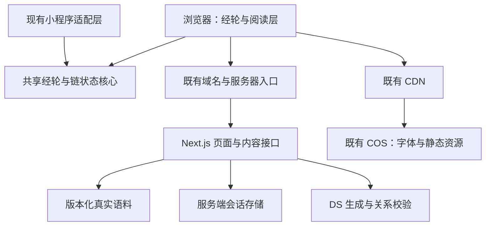
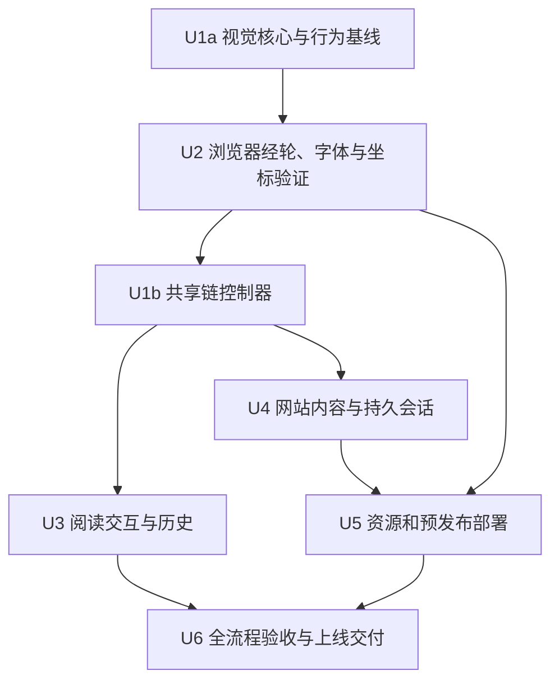

# 小程序体验迁移到个人网站

## 1. 目标与本次边界

将当前小程序的完整体验迁移到浏览器：全屏经轮、无限向上流动、字词接续、停驻阅读、原文、来路和个人注脚。网站与小程序沿用同一套视觉规则、经文身份和内容核心，后续可以分别发布。

用户已确认具备域名、服务器、COS 和 CDN，并已完成备案。本计划按复用这些资源设计，不以购买新服务、重新备案或搭建另一套内容平台为前提。此段为制定计划时的调查状态；2026-09-28 已核验具体参数并部署公网预览，现场记录见 `docs/deployment/web-flow.md`。

**本次按用户明确要求执行本迁移计划。** 计划中的目标、模块、接口约束和验收标准作为实施合同；2026-09-28 后续用户已要求利用本机钥匙串继续公网迁移，并指定关闭现有服务器 Docker 后继续部署。执行记录随阶段验收更新，未完成的真机、故障注入及完整回滚检查不得标为通过。

工作量判断：浏览器体验适配为中等规模；加上公开访问所需的会话持久化、资源发布和真机验收，整体为中等偏大。不能将 WebGL 可复用等同于整页可以直接复制。

## 2. 必须保留的体验

| 编号 | 要求 | 迁移后的验收含义 |
|---|---|---|
| R1 | 全屏主视觉 | 黑场、玻璃色散、固定竖轴、五层水平经文；中心最大最清晰，上下逐渐缩小、模糊、隐去；相邻行交错差速慢转 |
| R2 | 无限延展 | 批次结束不停止经轮；没有新节点时已加载内容继续流动；新内容在视野外的完整经句边界加入，不改写正在看的行 |
| R3 | 经文本体是入口 | 经轮与原文中有意义的词、单字均可接续，标点和空白不成为链接；身份使用可信原文范围，不按同字任意跳转 |
| R4 | 连续分叉与返回 | 点词后保留旧句，目标经文和字体准备好再承接；可连续分叉，返回恢复位置、旋转相位、流动状态及阅读滚动位置 |
| R5 | 保持阅读层关系 | 流动时只见经文；解释随停驻阅读层展开，不添加常驻底部短解或卡片区；输入一念可选，无需反复输入 |
| R6 | 字体和文字职责清楚 | 经文、完整原文使用现有康熙体及补字；系统文案和解释使用简体系统字体；经文保持可信原字 |
| R7 | 真实内容全流程 | 复用现有真实语料、原文核对、语境接续和 DS 生成；生成联系与人工内容清楚区分；失败可见、可取消、可恢复 |
| R8 | 本地积累与持久阅读 | 来路、阅读快照、用户注脚可保存和恢复；个人注脚仍可删除和撤销，不上传为模型感悟，不默认跨端同步 |
| R9 | 浏览器可用性 | 手机触摸、桌面鼠标、键盘阅读、窗口变化、后台恢复、减少动态效果和 WebGL 降级均可用 |
| R10 | 可运维的网站交付 | 使用现有服务器及 COS/CDN；密钥留在服务端，动态请求不被缓存；资源、内容版本和回滚配套；小程序行为回归通过 |

范围以 `miniprogram/README.md`、`miniprogram/docs/2026-09-23-classical-word-links.md` 的最新说明及实际代码为准。`miniprogram/docs/DESIGN.md` 中较早的 mock、字体覆盖量、入口范围记录仅作历史参考。

本次迁移不增加账号体系、微信与网站记录同步、社交、付费、打卡或新视觉效果。解释文字保留当前已有语义入口；“所有解释文字也可逐词探索”不冒充本次已有能力，需另行扩展。保留本地精选与已有阅读的回退能力，不承诺首次离线打开也能加载整个网站。

## 3. 已核实的复用基础与缺口

| 现有模块 | 证据路径 | 迁移处理 |
|---|---|---|
| Next.js 网站 | `package.json`、`src/app/page.tsx`、`next.config.js` | 复用现有 Next.js 15 / React 项目，新增独立 `/infidao` 路由，验收前不替换旧首页 |
| WebGL 视觉 | `miniprogram/flow/renderer.js`、`scene.js`、`atmosphere.js`、`atlas.js` | 保留 shader、几何和投影；适配画布、帧调度、尺寸、生命周期 |
| 时间轴及无限窗口 | `miniprogram/flow/timeline.js`、`ribbon-window.js` | 保留 32 个复用槽位、连续位置和视野外追加规则 |
| 字形 | `miniprogram/flow/glyph-outline.js`、`typography.js`、`chain-fonts.js`、`public/flow-fonts/` | 保留字体文件解析及字形缓存；替换微信字体注册与下载接口 |
| 页面及链状态 | `miniprogram/pages/flow/index.js`、`miniprogram/flow/chain-page.js` | 当前约 1,050 行，含页面状态、截帧、链管理和平台调用；须拆开状态控制和页面渲染，不能机械翻译 WXML |
| 内容核心和接口 | `src/lib/flow/`、`src/app/api/flow/route.ts`、`miniprogram/flow/remote-provider.js` | HTTP 已有 `open / branch / next` 和 NDJSON；Provider 的 `resume` 使用 `open({chainId})` 补全有效会话，网站须保留 |
| 内容资源 | `data/corpus-manifest.json`、`scripts/build-wechat-local-core.ts` | 小程序当前打包 11,722 条可用记录；网站服务端复用同一语料来源，不向浏览器一次下发完整语料 |
| 本地精选 | `miniprogram/flow/curated-provider.js`、`miniprogram/content/` | 迁移精选内容、预制关联及恢复规则；随网页交付小份阅读资源，不依赖内容接口启动 |
| 本机历史 | `miniprogram/flow/chain-store.js`、`notes.js` | 复用记录含义和恢复规则；浏览器持久化改为异步接口 |
| 服务器部署文件 | `Dockerfile`、`docker-compose.yml`、`nginx.conf` | 可作为修改起点，不能认定与现网一致或直接照搬 |

上线前需要补齐的具体缺口：

1. `service.ts` 的链、去重和游标状态目前在进程内存中，最多 256 条、6 小时过期。网站重启或多实例会丢失生成上下文；浏览器保存的阅读副本无法自动补回服务端状态。
2. API 当前接收客户端提供的 `x-flow-session`，限流也在进程内。公开网站需形成服务端签发的访客会话、可信代理来源和模型预算边界。
3. `Dockerfile` 使用 Node 18，而 `package.json` 要求 Node >=20；发布前选择仍受支持且通过仓库验证的 Node LTS，构建与运行保持一致。本计划不顺带升级 Next.js 主版本。
4. 容器未显式复制语料清单及其全部引用文件；`docker-compose.yml` 又将整个 `/app/data` 挂载为卷。必须验证构建追踪及挂载后的真实语料路径，避免空卷遮住发布语料。
5. 旧 `nginx.conf` 的 API 规则没有专门声明流式缓冲策略；需实测真实网关能逐事件传输，不能以本地成功代替公网结果。
6. `docs/DEPLOYMENT_GUIDE.md` 仍是多云通用方案。它不是用户现有 COS/CDN/服务器的实况清单。
7. 当前 `open({chainId})` 会拒绝过期链；只传 `seed` 则另起主题，无法保证从原来的经句或词继续。须兼容扩展重新展开的请求合同，不能只增加一个前端按钮。

## 4. 拟采用的架构

以下为待实施的职责设计；接口语义是约束，具体 helper 名称可在实现时调整。

### 4.1 路由和基础设施分工

- 浏览器入口拟为 `/infidao`，`/api/flow` 与页面同源。若个人主页由另一套应用托管，可在现有域名下用独立子域承载本 Next.js 应用，由个人主页链接进入；最终挂载位置是部署前待填参数，不需要重写个人主页。
- 服务器运行 Next.js、原文检索与核验、模型请求和会话管理。复用现有项目中的内容服务能力，不另造内容平台。
- COS 存放公开且可缓存的字体、静态资源及发布清单；CDN 加速这些资源。个人一念、注脚、生成响应和密钥不上传到公开资源桶。
- 第一版将字体及明确可静态化的资源接入 CDN；`/_next/static` 是否同批托管以现有发布能力决定。HTML 与动态接口仍由服务器处理，避免为一次迁移引入全站静态导出限制。
- 不把仓库中的示例域名、Compose 服务或旧部署文档视为现有基础设施。实施时只核对本应用所需的路径、端口、证书和资源配置。

Next.js 的自托管文档说明了反向代理与流式传输的部署要求，迁移采用现有服务器路线。框架细节以项目锁定的 15.x 版本为准：[Next.js 15 自托管](https://nextjs.org/docs/15/app/guides/self-hosting)。

### 4.2 共享核心与平台边界

拟新增 `shared/flow/`，作为视觉算法、字形、词范围、时间轴、窗口及链状态的唯一源。优先迁移现有算法，不同时改变旋转公式、色散参数和排版节律。

- 网站通过构建系统引用共享源；小程序通过专用构建脚本生成包内 CommonJS 模块，旧导入路径保留兼容入口，不能从小程序包外运行时取文件。
- 与字体资源绑定的解析器改为注入字体源；保留 OpenType 依赖及许可。语料与字体生成源继续沿用现有脚本，不手工编辑生成产物。
- 页面只负责交互事件和展示。`shared/flow/controller` 负责锁定点击、取消请求、接收事件、切换链、保存恢复；不依赖 `Page`、`setData`、DOM 或 `wx`。浏览器 `controller-host` 只注入平台能力并连接 React，不复制另一套链状态机。
- React 只接收离散 UI 状态变化；每帧位置在渲染器内部推进，避免每帧更新整个组件树。
- 按模块逐步抽取，每步对照原有测试；先完成 U1a 视觉核心，再通过 U2 手机浏览器经轮、字体及坐标验证，之后完成 U1b 共享链控制器。保持小程序接口与行为，不进行全仓库重构；完整范围仍包含全部实施单元。

| 边界 | 输入与输出约束 |
|---|---|
| 内容 Provider | 保留 `open / branch / next` 和远程 `resume({chainId})`；`resume` 映射现有 `op: open`，只补全有效链。`open` 兼容增加 `restartFrom`，用于明确重新展开；远程任务可取消并接收 `head / frame / done / error`。精选 Provider 保留 `restore` 恢复已存链 |
| 字词选择 | 继续携带 `chainId / fromFrameId` 和 `selection.start / end / textHash / corpusVersion`；范围按完整原文 UTF-16 位置计算 |
| 场景适配器 | 画布、帧时钟、尺寸及 DPR；点击与渲染使用同一投影，屏幕坐标只在平台边界换算一次 |
| 字体适配器 | 按经句及原文准备字形和 DOM 字体；成功、缺字、下载失败分别返回，不静默换成黑体 |
| 阅读存储 | 异步读取、事务保存链与快照、读取来路、删除注脚；保存失败不能破坏上一份有效记录 |
| 视图订阅 | 返回当前句、等待/错误、阅读层、来路等状态；旧请求和旧页面实例不得覆盖新状态 |

### 4.3 浏览器中的视觉、点击与字体

- 保留同一 WebGL 画布作为主场景，DOM 阅读层覆盖在同一空间中；保留停驻收敛、原文展开和分叉承接。仅在需要交叠旧/新场景的过渡时保留短时画面副本，不让每次点词固定等待截帧和图片解码。
- Pointer Events 统一触摸、鼠标和笔：按下锁词、超过阈值转为拖动、取消事件释放锁；一次抬起只能产生一次接续。触摸屏点击后生成的兼容鼠标事件不能再触发一次。
- 从画布真实边界及变换计算局部位置。校验页面滚动、阅读层位移、DPR、横竖屏和地址栏伸缩，避免再次出现“有反馈但无跳转”的坐标错误。
- 保留字体轮廓绘入图集的路径，DOM 使用同一字体文件；系统层用独立字体栈。浏览器字体加载可用 `FontFace` 与 `document.fonts` 确认完成：[MDN CSS Font Loading API](https://developer.mozilla.org/en-US/docs/Web/API/CSS_Font_Loading_API)。
- 首屏只准备当前窗口和首段原文需要的字体；其他分片按需加载。字体清单与内容版本绑定，重复分片复用，失败可重试并保留静读。
- 手机保留当前构图；宽屏保持竖轴和满屏场景，调整投影宽度、字号与阅读列宽，不把手机截图拉宽。输入时避让软键盘与底部安全区。
- 暂停、查看原文、恢复流动均有可聚焦的文字入口；完整经文在 DOM 阅读层提供相同字词操作，键盘用户无需命中 Canvas 坐标。
- 后台停止推进，恢复不跳过一大段；减少动态效果直接静读并允许主动恢复。WebGL context 丢失或资源不足时保留当前经文和阅读功能。

### 4.4 浏览器来路、本地记录与生成会话

浏览器用 IndexedDB 保存链、快照、阅读位置和注脚，启动时先恢复数据再绑定经轮。不能把现有同步存储方法简单改成返回 Promise；控制器中保存、切换和恢复的顺序必须相应调整。

- 快照保留 `position / rowOffset / ambientPhase / paused / sourceOpen / readingPositions / ribbon` 等当前字段，并增加存储版本。
- 分叉呈现提交时新增一条浏览器历史：可信首句及字体就绪，父链快照和新路径已保存，且操作版本仍有效，才切入新句并记一次历史；不必等解释完成。`frame / done` 只补全同一记录。首句呈现前的等待或失败、滚动和每次经过经句不新增历史。应用内返回与浏览器后退走同一恢复路径；前进恢复已读子链，完整节点不重新生成，未完成节点按下述规则补全。
- 历史 URL/state 只含不透明的本地路径标识，不包含用户一念、注脚、密钥或全文。根链后退沿正常浏览历史离开，不设返回陷阱；直接打开失效标识时提示恢复能力并进入可读状态。
- 刷新和重新打开恢复已保存的阅读；存储不可用时使用内存路径和快照维持本次前进、返回，并明确说明刷新后可能丢失。持久化失败不覆盖旧记录；不得因一次失败撤销已经呈现的父子关系。微信内记录不会自动出现在网页上。
- 服务端拟引入可序列化会话存储，生产使用持久化 Redis，端上预览保留内存适配器。仓库 Compose 已描述 Redis，但现网是否运行尚未核验；不得复用会随缓存淘汰的存储而不处理丢失情况。
- 持久化链节点、游标、分叉映射、去重信息和最后活动时间；临时 `busy` 改为有期限、带持有者和操作版本的锁。已核验并发出的首句是可恢复检查点，取消不得删掉；尚未核验的模型输出不得提交。提交与重放规则见 4.5.2。
- 首版保留明确的会话有效期。有效期内服务重启可继续；真正过期时，本地旧阅读仍可返回，明确提供“从此处重新展开”，不能伪称恢复了已丢失的生成游标。新会话与旧来路关联保存，避免覆盖旧路径。

首句与解释的生命周期必须区分，不能只用一个 loading 标志控制整条链：

| 阶段 | 服务端与本机记录 | 页面及恢复行为 |
|---|---|---|
| 尚无可信首句 | 保留父链、请求身份和等待状态；不保存模型草稿为经文 | 旧句继续可读；取消或失败不新增浏览器历史 |
| 首句已核验，解释未完成 | 先持久化 `ready: false` 首句及稳定的链/节点身份，再发出 `head`；本机保留可恢复副本 | 字体就绪后即可呈现、点词、分叉；禁止把临时游标当作可 `next` 的完成游标 |
| 首句呈现后取消或断开 | 保留已发布首句、父子关系及阅读位置，丢弃未提交的解释 | 返回有效链时用 `resume({chainId})` 补全同一句，不新建链或历史；明确的失败、主动停止不触发无限自动重试 |
| 解释核验并提交完成 | 以原 `frameId` 补全解释、入口及完成游标 | 原位更新；不更换经句、滚动位置或浏览器历史；返回完整节点直接读本机副本 |
| 在线会话已过期 | 旧快照、注脚及来路继续保留 | `resume` 明确失败；由用户触发 4.5.1 的重新展开，成功后新增路径而非覆盖旧链 |

验收固定操作为：A 的首句刚出现、解释仍在生成 → 点词进入 B → 取消 A 的未完成请求 → 返回 A → 补全解释。两端都须保持 A 的 `chainId / frameId / quote`、阅读快照和一次历史记录；服务重启后重复此操作也适用。

### 4.5 内容接口、访客会话与模型调用

沿用 `src/lib/flow/contracts.ts` 的操作和事件类型，仅为重新展开兼容增加可选字段及其校验；不更换传输协议，不在本轮更换模型或扩张语料范围。旧客户端不携带新字段时保持原行为。

- 浏览器同源请求 `/api/flow`，使用 NDJSON；按 UTF-8 和换行边界增量解析。经句先到就可读、可选择，后续解释原位补全；`ready: false` 表示内容尚未完整，不等同于整页不可操作。
- 以 `requestId` 和当前操作版本过滤晚到事件；切换、取消、离开页面时终止请求。断开发生在首句之后时保留首句，并显示未完成状态与重试入口。
- DS Key 仅由服务器运行环境读取，网站访客无需输入 Key。模型配置沿用现有 `FLOW_*` / `DEEPSEEK_*` 机制，不打入前端变量或 COS 资源。
- 网站拟新增轻量匿名会话签发接口，使用安全、HttpOnly、SameSite Cookie 标识归属；验证同源请求。现有小程序 HTTP 请求身份通过兼容适配处理，不借此强制修改端上直连预览路线。
- 生产不能继续仅凭任意格式的 `x-flow-session` 启动付费模型请求。旧 HTTP 测试路径须限制在明确的测试环境，或升级为服务端签发凭证；上线前完成兼容回归。
- 网关与应用共同限制单访客、来源 IP、站点总并发和模型用量；只信任受控入口传来的代理地址。公开访问的具体额度在上线前确认，未配置时不开放无限调用。
- 记录请求 ID、耗时分段、结果和资源版本，不记录 Key 或默认采集用户一念全文。不能因换成网站就承诺 DS 本身更快；分别测量内容生成、字体准备和过渡耗时。

#### 4.5.1 从旧经句或字词重新展开

在 `op: open` 中增加可选 `restartFrom`，沿用已有 `selection` 表达词范围。以下字段为实施合同；所有范围均按可信完整原文的 UTF-16 位置计算：

| 字段 | 语义与校验 |
|---|---|
| `restartFrom.sourceId / corpusVersion / textHash` | 标识旧经句所依据的原文；服务端重新取原文并核验，不能信任浏览器提交的全文或解释 |
| `restartFrom.quoteStart / quoteEnd` | 旧经句在完整原文中的合法非空范围；用于保留阅读语境 |
| `selection`（可选） | 沿用已有 `start / end / textHash / corpusVersion`；有值时从该原文词义展开，无值时从旧经句展开。词可位于完整原文中，不必局限于画布摘句；版本和哈希须与 `restartFrom` 一致，并通过现有词范围核验，不能截断字或仅包含标点 |
| `seed`（可选） | 沿用当前一念的长度与输入规则；作为用户输入处理，不作为可信引文；不附带用户注脚 |
| `requestId` | 必填；相同访客、相同请求重试复用已建立的新会话；同一 ID 配不同请求内容须拒绝 |

`restartFrom` 与 `chainId / fromFrameId / anchorId / cursor` 互斥；普通 `open` 不接收无 `restartFrom` 的 `selection`。这不是绕过过期链归属检查：接口只读取可公开核验的经典原文，并为当前访客建立新会话，不读取或接管旧访客的私有链状态。

服务端根据核验后的原文、选词和当前一念重新确定语境，沿用原文核验、模型预算和关系拒绝规则。若对应版本不可用或哈希变化，返回明确的原文版本错误，保留旧阅读；不得按同字猜测位置或静默改成默认主题。新会话服务端 `parentChainId` 为空，浏览器另存新路径与旧本地路径的来源关系，确保仍能返回旧句；界面说明这是重新展开，不声称恢复了旧游标。等待期间旧句保持可读，首句呈现提交规则与普通分叉相同。

#### 4.5.2 会话提交、取消与重放

存储接口须表达下列操作语义，不以简单的异步 Map 读写代替：

1. **预留操作。** 在模型调用前，按访客与请求身份预留操作；相同父链、节点及规范化词范围/入口也须去重，不能只按词面缓存。预留返回锁持有者、操作版本和期限；并发重试复用已提交结果或报告仍在进行，不各自启动生成。
2. **提交可信首句。** 将新链身份、可信首句、父链分叉映射及请求关联一起原子保存，再发出 `head`。即使解释随后取消或进程退出，首句也能被再次读取、分叉和 `resume`；首句持久化失败不得先向浏览器宣告可恢复。
3. **提交完成结果。** 核验当前锁持有者、操作版本及预期游标后，原子保存节点补全、游标、去重信息及可重放结果，再发出 `frame / done`。提交不得用旧整链副本覆盖生成期间新增的分叉。首句解释中的锁不能阻止用户从该可信首句创建子链。
4. **终止及迟到结果。** 取消、失去锁或操作过期后，旧工作者不能再提交或释放他人的锁；释放须核对持有者。锁可续期，但写入仍须校验有效操作版本。预算占用也须在服务实例间一致，不能每个实例各算一份站点额度。
5. **重放。** 保存成功、响应断开时，重试直接重放原链、节点与游标，不再次调用模型。首句已保存但解释未完成时恢复同一检查点。模型已响应但结果尚未持久化就宕机时，可能需要重新调用模型；保证不重复提交内容，不承诺无法控制的外部计费恰好一次，并将这种重试计入预算。

锁期限不能单独保证写入安全；实现和测试须包含操作版本校验及原子提交。[Redis 分布式锁说明](https://redis.io/docs/latest/develop/clients/patterns/distributed-locks/)讨论了锁有效期与持有者校验的边界；本计划不要求增加 Redis 集群。

### 4.6 本地精选与已有阅读回退

- 从现有 `curated-provider.js` 及精选内容生成源迁移一份小型精选包、预制关联、分词范围和所需基础字体，随网页应用交付；基础字体保留同源可用路径。不得把全部 11,722 条语料打进浏览器，也不能把仅供测试的 fixture 当作生产回退。
- 精选包构建时从同一语料源核验 `sourceId / corpusVersion / textHash` 及引文范围，不沿用旧精选中与服务端版本不一致的固定标签；将精选到远程重新展开纳入联调，避免精选可读却始终无法通过远程版本校验。
- 页面及精选资源已加载、没有可恢复阅读时，首次内容请求失败、超时或额度耗尽须进入标明“本地精选”的可读状态；精选初始化和既有分支不依赖内容接口或 DS。资源本身未加载成功时显示明确重试，不承诺首次完全离线打开网站。
- 已有远程经句时，任何请求失败都保留当前链、经句及来路，提供停止等待、重试和返回；不得自动换成精选、重置一念或覆盖远程会话。用户主动进入精选时另存路径。
- 精选保留点词反馈和预制的可信接续；没有离线关联的词明确说明暂不能离线展开，不伪造新经文或解释。远程服务恢复后不自动抢占当前阅读；用户主动重新展开时走 4.5.1，返回精选仍恢复原位置。
- 已存精选链通过 `restore` 恢复预制关系；已存远程链可离线阅读，生成新关系仍需服务可用。两类链保留各自来源身份，均保留注脚，不将人工联系标成模型生成。

## 5. COS/CDN 与服务器发布约定

| 资源 | 放置位置 | 缓存与发布规则 |
|---|---|---|
| HTML 与应用入口 | 现有服务器 | 随应用发布，不使用长期 immutable 缓存 |
| `/api/flow` 与会话接口 | 服务器同源路径 | 不进入 CDN 缓存；关闭会阻塞事件的代理缓冲；超时覆盖整个生成链路 |
| WOFF 分片、公开图形资源 | COS，经 CDN 访问 | 文件名或目录含版本/哈希，长期缓存；先上传和验证再发布引用 |
| 精选内容与基础字体 | 应用同源的版本化静态资源；可另有 CDN 副本 | 与应用一同发布，初始化不依赖模型接口；字体 CDN 故障可使用同源基础字体，仍须核验版本 |
| 字体清单 | 与本次发布绑定的 COS 路径 | 应用固定引用明确版本，不让旧页面读到新清单配旧文件 |
| 真实语料及索引 | 服务器只读发布目录 | 与应用、字体清单记录兼容版本；不放在可写业务卷的同一目录 |
| 生成会话 | 私有持久存储 | 带 TTL、归属和版本；不通过 COS/CDN 对外提供 |
| 注脚与浏览器阅读副本 | 本机 IndexedDB | 版本化、可恢复；个人注脚删除与撤销保持 |

跨域字体和二进制下载需要同时核对 COS 与 CDN 的响应头、字体 MIME 和缓存结果。按站点配置允许来源，验证真实 CDN URL；只改源站配置而未更新边缘缓存不算通过。[腾讯云 COS 跨域访问配置](https://cloud.tencent.com/document/product/436/13318)。

发布记录绑定应用提交、构建编号、语料版本、字体清单版本和存储 schema。顺序为资源上传及校验、预发布应用验证、站点入口切换；回滚切回上一应用及对应清单，保留仍被旧页面引用的资源。数据库/会话 schema 变动须有向后读取或明确失效处理，回滚不能静默清空注脚。

## 6. 实施单元与依赖

原顺序为 U1a → U2 手机验证 → U1b → U3/U4 → U5/U6。**2026-09-26 用户在本地回归通过后，以“你做吧”“继续”确认调整：现在继续 U1b、U3/U4，实际 iPhone Safari／微信验收移为上线前必需门槛。** 2026-09-28 后续用户继续授权部署，现已在 `/infidao` 提供公网预览，但该入口不等于真机验收或最终首页切换。完整共享状态机与持久化仍属交付范围；此调整不授权启动 agent、创建分支或 worktree。

### U1：共享核心与行为基线

- [x] U1a：完成共享视觉边界、特征测试与小程序兼容构建。
- [x] U1b：共享链控制器及两端适配完成，本地回归通过。

**目标 / 要求：** R1–R4、R8、R10；U1a 无依赖，U1b 依赖 U2。

**文件：** 新建 `shared/flow/`、`scripts/build-wechat-flow-runtime.ts`；适配 `miniprogram/flow/` 对应入口及 `scripts/build-wechat-local-core.ts`。测试拟为 `tests/unit/flow-runtime-parity.test.ts`，并保留 `miniprogram/tests/` 相关用例。

**实施：** U1a 先为既有运动、投影、词身份及槽位建立特征测试，抽取视觉算法并注入平台能力，供 U2 使用。U1b 再以快照和请求生命周期测试抽取 `shared/flow/controller`，统一异步存储顺序、首句检查点、取消、恢复与分叉呈现提交；小程序同步存储由适配器接入，不机械把旧调用改成 Promise。内容核心仍在 `src/lib/flow/`；生成的小程序文件可重建且没有包外依赖。

**测试与验收：** U1a 保证同一内容和时钟输入在两端得到一致的位置、相位、命中词及窗口身份；奇偶行数回环和长距离拖动不改变旋转身份，新内容追加不移动可见句。U1b 保证首句未完成时分叉再返回仍可补全、取消后的结果不改变当前阅读、持久化失败保留旧快照。两阶段均要求重建结果可重复、原有小程序相关检查通过。

### U2：浏览器经轮与字体

- [x] 在独立路由呈现与小程序一致的主视觉。
- [x] 完成 production build 的桌面与窄屏浏览器检查，并留存截图。
- [x] 验证停驻阅读、本地字词接续与返回、减少动态效果下静读及主动恢复。
- [ ] 在真实 iPhone Safari 和微信内置浏览器检查触摸词位、字体、地址栏位移与横竖屏；按 2026-09-26 用户确认移为上线前门槛。

**目标 / 要求：** R1、R2、R3、R6、R9；依赖 U1a，不等待完整链控制器。

**文件：** 新建 `src/app/infidao/page.tsx`、`src/components/flow/FlowExperience.tsx`、`WheelCanvas.tsx`、`flow.module.css`、`src/lib/flow-browser/renderer-host.ts`、`fonts.ts`。测试拟为 `tests/unit/flow-browser-renderer.test.ts`、`flow-browser-fonts.test.ts`；视觉记录归 `docs/qa/web-flow-migration/`。

**实施：** 使用真实内容 fixture 和可控 Provider 驱动共享渲染器，先验证呈现及选择身份；浏览器画布、字体、resize、后台和减少动态效果适配。DPR 与渲染分辨率按设备预算限制，不随桌面窗口无限放大缓冲。此处 fixture 只用于验证，生产精选回退在 U3/U4 实施。

**测试与验收：** 窄屏、宽屏、横屏五层位置一致；中心文字可读且无周期空窗；DOM 原文与画布字形一致；分片失败/缺字不换成黑体；context 丢失保留静读；组件重复挂载不留下第二条动画循环或 GPU 资源。按 2026-09-26 用户确认，在上线前于实际 iPhone Safari 与微信内置浏览器核验经轮、字体及按下/抬起的词范围，包含画布位移和地址栏伸缩；该验证不代替 U6 全设备验收。

**执行记录：** 2026-09-26 复查修复后台暂停、多指输入、WebGL 恢复、字体并发加载、减少动态效果下的快照恢复，以及横屏长句重叠。production build 的 1280 × 720、844 × 390、390 × 844 浏览器预览、静读、精选分叉/返回和故障注入检查已通过；原始证据见 `docs/qa/web-flow-migration/2026-09-26-u2-regression.md`。按已确认顺序，U1b/U3/U4 已继续实施；实际 iPhone Safari 和微信真机门槛仍留在公开上线前。

### U3：阅读交互、字词分叉与本地历史

- [x] 完整迁移停驻、阅读、来路及个人注脚，并完成本地浏览器与存储故障回归。

**目标 / 要求：** R3–R9；依赖 U1b（已包含 U2 验证）；先用可控 Provider 和本地精选验证，最终与 U4 联调。

**文件：** 新建 `src/components/flow/ReadingLayer.tsx`、`LinkedText.tsx`、`SeedSheet.tsx`、`NotesPanel.tsx`；新建 `src/lib/flow-browser/controller-host.ts`、`pointer.ts`、`storage.ts`、`history.ts`，连接 U1b 的共享控制器。复用并适配现有 `miniprogram/flow/curated-provider.js` 及 `miniprogram/content/` 对应生成源，产出共享精选模块。测试拟为 `tests/unit/flow-browser-interaction.test.tsx`、`flow-browser-history.test.ts`、`flow-browser-storage.test.ts`、`flow-browser-curated.test.ts`。

**实施：** 页面状态与链控制分离；IndexedDB 事务保存，故障时保留内存来路。每次分叉在首句呈现提交时只产生一个路径记录，解释后到只更新该记录；区分有效链 `resume` 与过期后主动重新展开。接入精选包、恢复和来源标识。遵守现有交互层级，不复用旧网站的卡片流作为新经轮页面。

**测试与验收：** 点经轮/原文同一字词进入一致语境；重复字、跨行词范围准确；拖动、pointercancel、连续点击不误分叉；十次分叉逐层返回和浏览器前进恢复完整快照；未完成首句分叉后返回可补全且不重复记历史；刷新保留来路；quota/存储不可用不损坏旧记录，本次会话仍能前进返回；精选刷新恢复、无离线关联的词提示和来源标识可用；一念草稿、原文定位、注脚删除撤销可用；键盘能完成阅读与接续。

### U4：网站 Provider 与可恢复内容会话

- [x] 本地打通真实语料、DS、逐段返回和持久会话重启恢复；公网网关验收另属 U5/U6。

**目标 / 要求：** R4、R7、R8、R10；依赖 U1b，与 U3 完成后联调。

**文件：** 新建 `src/lib/flow-browser/provider.ts`、`src/lib/flow/session-store.ts`、`session-identity.ts`、`src/app/api/flow/session/route.ts`；修改 `src/lib/flow/contracts.ts`、`service.ts`、`src/app/api/flow/route.ts` 和端上构建的存储适配。测试拟为 `tests/unit/flow-session-store.test.ts`、`flow-browser-provider.test.ts`、`flow-restart.test.ts`、`tests/integration/api/flow.route.test.ts`；回归既有 `tests/unit/flow-service.test.ts`、`flow-relations.test.ts`。

**实施：** 兼容扩展 `restartFrom` 并保留 `resume`；按 4.5.2 实现操作预留、可信首句提交、完成结果提交及重放，生产持久化、端上内存采用相同语义。完善匿名归属、限额与持有者/操作版本校验。浏览器 Provider 与 U3 精选模块联调首次失败回退及主动重新展开，禁止故障时替换已经呈现的远程链。新依赖仅限这一存储适配实际需要的部分。

**测试与验收：** 流式中文跨 chunk 不损坏；首句到达后可读可点，解释后到不替换经句或滚动位置；首句提交后取消、重启再 `resume` 保持身份；保存成功但响应断开后的重试复用结果且不调用模型；两个实例并发请求不重复提交，锁过期后的旧工作者不能覆写或解锁新操作；生成期间新建的子链映射不丢失；过期后从原句/词重新展开并可返回旧路径，版本不符明确拒绝；不同访客不能读取/续写彼此链；预算命中不调用模型；首次请求失败进入精选，已有远程链失败保留原句；语义拒绝不放宽原文核验。

### U5：服务器、COS/CDN 和预发布交付

- [ ] 已生成版本化字体及发布清单，修正镜像、语料、Redis 和流式代理配置；2026-09-28 目标 COS/CDN 的 14 个字体对象和清单上传、逐项验证通过。现有服务器独立 Node/Redis 应用、HTTPS `/infidao` 公网预览、真实网关分段与重启重放通过；故障注入、真机及完整回滚演练仍待验收。

**目标 / 要求：** R6、R7、R10；依赖 U2、U4；实际远程变更须另获部署授权。

**文件：** 修改 `Dockerfile`、`docker-compose.yml`、`nginx.conf` 中本应用需要的部分；按实际接入需要调整 `next.config.js`。新建 `scripts/build-web-flow-assets.ts`、`docs/deployment/web-flow.md`；测试拟为 `tests/unit/web-flow-release-manifest.test.ts`、`tests/integration/flow-deployment.test.ts`。

**实施：** 核对服务器与 CDN 参数；生成版本清单，包含精选内容和同源基础字体；修正 Node、语料打包/挂载、流式转发和会话持久化。预发布使用独立的应用配置及私有数据命名空间；不让测试限流或会话影响现有小程序用户。

**测试与验收：** 在无开发机目录的干净运行环境中真实选文成功；挂载后语料仍完整；通过最终 CDN URL 加载字体并校验版本；阻断内容接口及字体 CDN 后同源精选资源仍能提供基础阅读；公开产物不含模型密钥；经真实网关能在生成完成前读到首事件；应用重启可恢复有效链；上一版本的页面及字体在回滚后仍正常。

### U6：全流程、设备与上线验收

- [ ] 完成浏览器体验验收和可公开访问验收，交付证据。

**目标 / 要求：** R1–R10；依赖 U3、U5。

**文件：** 新建 `tests/e2e/web-flow-migration.spec.ts`、`docs/qa/2026-09-23-web-flow-migration-acceptance.md`；更新网站运行说明与 `docs/deployment/web-flow.md`。浏览器自动化仅用于关键交互与视觉验收，沿用仓库现有能力。

**实施：** 同一内容、时钟和手势脚本对比小程序与网页；真实 DS 联调用小批代表词，并保留无关联、超时、网络取消等失败样本。截图核对真实 WebGL 合成结果；自动化不能冒充手指操作或真实 Safari 性能。

**测试与验收：** 见下一节。公开域名切换前，提供可打开的预发布地址、验收报告及回滚目标供用户确认；不能用“网页能打开”代替全流程验收，也不自动执行首页替换。

## 7. 验收矩阵与完成标准

| 场景 | 必须观察的结果 |
|---|---|
| 首次进入 | 原视觉全屏出现；示例身份明确；不要求输入一念或 API Key；没有底部常驻解释 |
| 持续阅读至少 10 分钟 | 自动上升及交错旋转持续；后续内容加入不挪动可见行；显示槽位保持有界，资源没有持续无界增长 |
| 经轮与原文点词 | 有即时范围反馈；锁定的词与请求一致；实际出现可信新经句或可读错误，不能只有反馈无结果 |
| 连续 10 次分叉与返回 | 来源词、父链、相位、流动/停驻、原文展开、滚动位置都恢复；返回完整节点不重复生成；前进与后退不新增历史 |
| 首句未完成就继续分叉 | A 首句出现后进入 B、取消 A 的解释、返回 A 并补全；A 身份、位置不变；每次首句呈现只记一条历史，`done` 不重复记；重启后仍成立 |
| 保存成功但响应断开 | 同一请求重试重放已提交结果；链、节点、游标一致，不再次调用模型 |
| 锁过期与迟到结果 | 新操作接手后旧请求不能覆盖结果或释放新锁；生成期间添加的父子关系不丢失；多实例预算不各算一份 |
| 阅读层与软键盘 | 解释后到原位更新；阅读不被页脚遮挡；原文立即定位；输入、关闭和恢复不重置经轮 |
| 断网、超时、DS 拒绝/限额 | 原句仍可读；停止等待、重试、返回可用；无全屏清空或无限 loading |
| 首次内容请求失败、无本机历史 | 页面及精选资源已加载时进入标明来源的精选；不要求输入 Key；可读、可停、可走预制关联，无离线关联明确提示；已有远程链不得因此被换掉 |
| 字体/COS/CDN 故障 | 可识别失败并静读或重试；清晰区不悄悄变黑体；旧版本资源不被清理导致白屏 |
| 刷新、后台、服务重启 | 本机阅读恢复；后台不推进；有效服务会话能续接；真实过期明确告知，不清除注脚 |
| 会话过期后重新展开 | 从原句或选词核验后创建新会话；旧句保留到新首句可呈现；本地来路连接新旧路径；原文版本失配不猜测词位，失败仍可返回旧阅读 |
| WebGL 失败或减少动态效果 | 静读、字词入口、原文、来路均可用；恢复图形后回到同一句 |
| 桌面与可访问性 | 鼠标、滚轮/拖动语义明确；键盘可暂停、进入原文并接续；焦点可见；窗口变化不误点 |
| 小程序回归 | 现有视觉、端上 DS 预览、离线精选、字词点击、来路和字体分包继续正常 |

设备至少覆盖实际 iPhone Safari、iPhone 微信内置浏览器、Android Chrome、桌面 Chrome 与 Safari；另外记录所用系统、浏览器版本和屏幕尺寸。允许设备能力不同，但不得略过手机真实触摸、WebGL 和字体检查。

性能分开记录，以下为目标而非现有成绩：

- 选词反馈 P95 ≤100 ms；准备缓存命中的新句 P95 ≤500 ms 可读。
- 未命中分支单独记录语境解析、模型生成/校验、字体、转场和总时长，不承诺网络生成在 500 ms 内完成。
- 首屏分别测冷/暖 CDN 缓存的“首句可读”和“图形可交互”；U2 建立设备基线后在报告中明确预算，不能凭本地帧率宣称真机流畅。
- 先维持当前小程序节奏和稳定帧间隔，再依据测量调整渲染分辨率；不以降低中心文字可读性换取平均 FPS。

两个交付阶段：

1. **浏览器体验完成：** U1a、U2、U1b、U3、U4 的行为及真实模型联调通过，包括精选回退和未完成/过期会话的不同恢复路径，预览完整复现当前产品；不标记为已公开上线。
2. **可公开访问：** U5–U6 通过，实际基础设施参数、费用上限、资源和回滚均明确，用户确认最终地址及发布。第一阶段不能替代第二阶段，也不作为缩减完整范围的理由。

## 8. 实施前与上线前待填信息

这些信息不阻塞计划编写；影响的步骤在其使用前确认，不需要用户现在提供密码或密钥明文。

| 信息 | 用途 | 最晚确认点 |
|---|---|---|
| 个人网站实际入口：独立子域或已有 Next.js 内的 `/infidao` | 确定路由、资源前缀和 Cookie 范围 | 网站路由集成前 |
| 服务器运行方式、可用 Node/容器、反向代理 | 选择复用现有进程管理及部署配置 | U5 远程准备前 |
| COS 桶、区域、CDN 域名及可写前缀 | 资源上传与跨域规则 | U5 资源发布前 |
| HTTPS 证书和域名解析所指入口 | 验证最终访问链路 | 预发布验证前 |
| 现有 Redis 是否可用、持久化与淘汰策略 | 确定隔离存储及内存预算；没有则在现有服务器配置专用实例 | U4 生产适配前 |
| 模型凭证注入方式、允许访客与站点用量上限 | 公开调用和费用控制 | 开放真实模型访问前 |
| 是否将该体验设为网站首页 | 独立页面完成后再决定入口替换 | 最终入口切换前 |

已备案作为用户确认的基础设施前提记录，本轮不重新要求办理，也不将其等同于所有运行参数已核验。

## 9. 风险、回归和文档交付

| 风险 | 应对与判定 |
|---|---|
| 共享抽取改变已调好的运动 | 单独冻结视觉参数；相同输入做两端行为对照；每个抽取步骤跑小程序相关回归 |
| DOM 层与 Canvas 投影失配 | 坐标统一、锁定按下目标，覆盖位移/缩放/地址栏/软键盘；实际手指验收 |
| 字体清单和语料混用版本 | 固定发布清单、校验文件；先资源后应用，保留前版本供回滚 |
| 异步存储导致先切链后保存 | 使用事务和操作版本；失败保留旧快照并提示，不静默丢失个人内容 |
| 请求取消、重启、多实例造成结果丢失或重复提交 | 首句单独持久化；校验锁持有者与操作版本，原子提交关联和结果；验证响应丢失重放及锁过期迟到；模型响应未落盘就宕机的再调用纳入预算，不承诺外部计费恰好一次 |
| 过期恢复退化成默认主题或错误词位 | `restartFrom` 重新核验原文与词范围；版本失配明确失败；新会话保留与本地旧来路的关联 |
| 服务故障时空白或强行换成精选 | 随应用交付小份精选及基础字体；仅无可恢复阅读时自动回退；已呈现远程链保持原句 |
| CDN/代理把首事件攒到完成再返回 | 真实公网分段观测；API 禁缓存及缓冲，不只检查 HTTP 200 |
| 桌面大画布或 Safari 资源不足 | 限制像素预算、按需字库、有界槽位；静读回退保持功能 |
| 模型质量和古文分词未被迁移解决 | 沿用核验，不以同字关联替代语义；报告真实拒绝/无结果，迁移验收不声称穷尽全部词义 |

最终交付应包含：网页源码、共享构建及适配、版本化资源清单、预发布地址、真实设备验收记录、发布/回滚说明、小程序回归结果，以及仍需用户决策的上线参数。2026-09-27 已完成 U1a、U1b、U3、U4 的本地实现和回归，以及 U2 的本地视觉验证。2026-09-28 已完成目标 COS/CDN 资源验证、现有主机独立应用部署、公网 `/infidao` 预览与真实网关分段；U2/U6 真机、U5 故障注入及完整回滚演练仍未完成。模拟手机视口未冒充真实设备；现有首页及 `/lubirth` 未变更。证据见 `docs/qa/web-flow-migration/implementation-progress.md` 与 `docs/deployment/web-flow.md`。

## 10. 资料来源

- 当前代码基线：`3e5dd67`。仓库知识图谱报告为较早版本，仅作导航；本计划以实际模块和近期文档为依据。
- 产品与字体：`miniprogram/README.md`、`miniprogram/docs/2026-09-23-classical-word-links.md`、`miniprogram/docs/2026-09-23-phone-preview.md`。
- 运行与数据：`src/lib/flow/`、`src/app/api/flow/route.ts`、`data/corpus-manifest.json`、`scripts/build-wechat-local-core.ts`。
- 本次修订对照：`miniprogram/flow/remote-provider.js`、`chain-page.js`、`curated-provider.js`、`chain-store.js` 和 `tests/unit/flow-service.test.ts` 中未完成首句分叉后恢复的现有用例；只读检查，不将测试定义当作本轮已运行成绩。
- 基础设施：用户本轮明确提供“已有 CDN / COS / 域名 / 服务器且已备案”；仓库 `Dockerfile`、`docker-compose.yml`、`nginx.conf` 仅用于识别配置缺口，未当作现网调查结果。
- 浏览器字体、自托管及 COS 配置依据见相应章节的官方文档链接；未读取其他项目、个人历史或云端私有资料。
